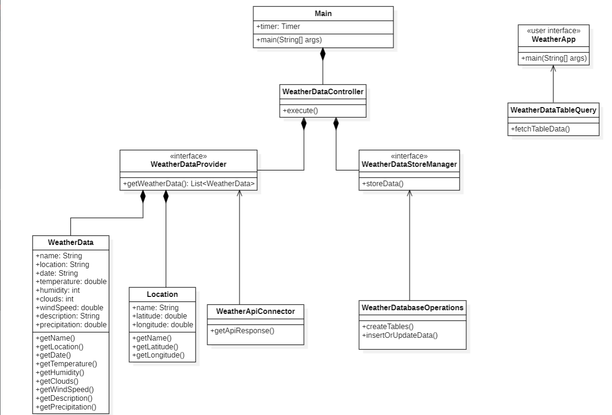

# Practice 1 (V2). Data capture from external sources.

Subject: Desarrollo de aplicaciones para ciencia de datos

Course: 2023-2024

Degree: Grado de Ingeniería en Ciencia de Datos

Shool: Escuela Universitaria de Informática

University: Universidad de Las Palmas de Gran Canaria

## Functionality Overview
This practice involves a Java application that periodically queries the 'openweathermap' API every 6 hours. The application aims to retrieve the weather forecast for the 8 islands for the next 5 days at 12 p.m. each day. The collected information is stored in an SQLite database, where there is a table for each island and an entry for each day. In this database, temperature, probability of precipitation, humidity, cloud coverage, and wind speed are recorded daily.

### Execution process
To execute the project, there must be a text file with the user's API key in the "resources" folder, named "ApiKey.txt." Therefore, in this folder, you should find this text file, the "Locations.csv" file, and the "README.md" document.

When running the "Main," you can verify that the tables for each island are in the database with new data inserted and previous data updated.

On the other hand, when executing the "WeatherApp" (user interface), you can observe that a tab opens where you can enter the name of one of the islands. It should be entered exactly as specified in the text displayed in the tab. Additionally, you must input the date to which you want to access, also following the specified format.
## Resources Used
- Development Environments: IntelliJ IDEA
- Version Control Tools: Git
- Documentation Tools: Markdown
- Programming language: Java
- Database Technology : SQLite
- Extern Services: Api from "openweathermap"

## Design

In this project, there are 10 different classes.
- The "Main" class, where the "execute()" function is called and runs periodically every 6 hours.
- The "WeatherApiConnector" class, where a function for making API calls is located.
- In the "WeatherDatabaseOperations" class, the "createTables()" and "insertOrUpdateData()" operations are found, which are used to create tables in the database and insert or update data in them.
- The "WeatherDataController" class contains the "execute()" function, where the rest of the functions are called to fulfill the purpose of the practice.
- The classes 'Location' and 'WeatherData' are used to create instances of themselves in some other implementations to fulfill the intended purpose.
- In the "WeatherDataProvider" class, the "getWeatherData()" function is used to retrieve data from the API.
- The "WeatherStoreManager" class has a "storeData()" function where it connects with the database and calls the "createTables()" and "insertOrUpdateData()" functions.
- Additionally, interfaces are created for "WeatherDataProvider" and "WeatherStoreManager," named "WeatherDataProviderInterface" and "WeatherStoreManagerInterface."
- Finally, a user interface named "WeatherApp" is implemented, which uses the function created in the "WeatherDataTableQuery" class to allow the user to enter the name of an island and a date to access those data.

### Patrones y Principios de Diseño
Regarding design principles:

Firstly, each class has a unique responsibility, such as WeatherApiConnector for API connection, WeatherDataProvider for weather data retrieval, WeatherDataStoreManager for storing data in the database...

Secondly, the code is open to extension, achieved by adding new implementations of interfaces or classes to adapt to different needs.

Furthermore, interfaces are designed for specific roles and do not contain unnecessary methods for their implementers.

Efforts are made to keep the coupling between classes low, as the function that is called in the "Main" depends only on the WeatherDataProviderInterface and WeatherDataStoreInterface, not on specific implementations, and cohesion is high within classes, as each is related to a specific task. Regarding modularity, the code is divided into modular packages and classes, each with a specific responsibility.

In addition, the "Location" and "WeatherData" classes are immutable, ensuring data stability.

Regarding patterns:

The strategy pattern is employed, where different implementations can be swapped as needed through the use of interfaces.

Additionally, the use of Timer and TimerTask for performing periodic tasks is a form of the observer pattern, where the timer observes and executes the defined tasks.

### Class Diagram
